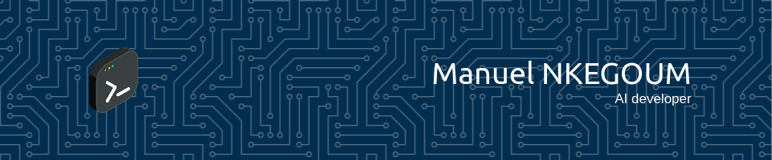

<!--
**Manuelnkegoum-8/Manuelnkegoum-8** is a ✨ _special_ ✨ repository because its `README.md` (this file) appears on your GitHub profile.

Here are some ideas to get you started:

- 🔭 I’m currently working on ...
- 🌱 I’m currently learning ...
- 👯 I’m looking to collaborate on ...
- 🤔 I’m looking for help with ...
- 💬 Ask me about ...
- 📫 How to reach me: ...
- 😄 Pronouns: ...
- ⚡ Fun fact: ...
-->

###  👋 Hi there  I'm Manuel NKEGOUM 

)

-  🎓 AI Student at Institut Polytechnique de Paris
- 🧠 Passionate about the fields of Artificial Intelligence, Machine Learning and Deep Learning, I'm determined to contribute to the future of these exciting technologies.
- ⚽ An avid soccer fan, I played as a defensive or central midfielder on my university's soccer team.
- 🔬 An aspiring researcher, I strive to explore the frontiers of data science to solve complex problems and provide innovative solutions.
- 🤝 I'm open to collaboration opportunities, challenging research projects and discussions about the exciting future of AI and ML.

### 🔭 I will soon be starting work on an exciting research project related to Natural Language Understanding (NLU) at Orange
My research topic will focus on how automatic speech understanding models adapt to the context of dialogue. Specifically, we will focus on task-oriented dialogues in which two interlocutors exchange information in order to collaboratively solve a task.

### ⚡ Projects
- Structured output learning with conditional generative flows 
- Rainbow : Combining Improvements in Deep Reinforcement Learning 
- Image Captioning with Vision transformers 
- Vision TRansformers for small dataasets 

###  🧰 Languages and Tools

###  👯 Interested in Pursuing a PhD in AI

 Highly motivated to pursue a PhD in Artificial Intelligence or a related field. My research interests include NLU/NLP, computer vision,Generative AI.
